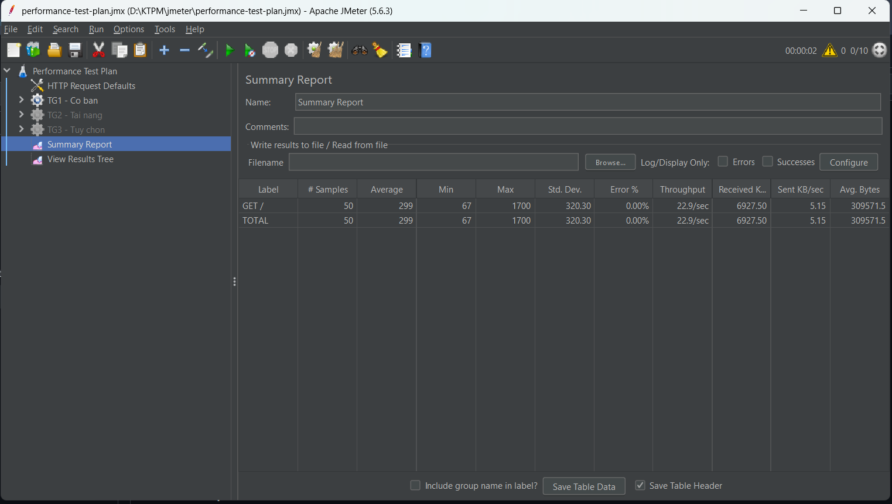
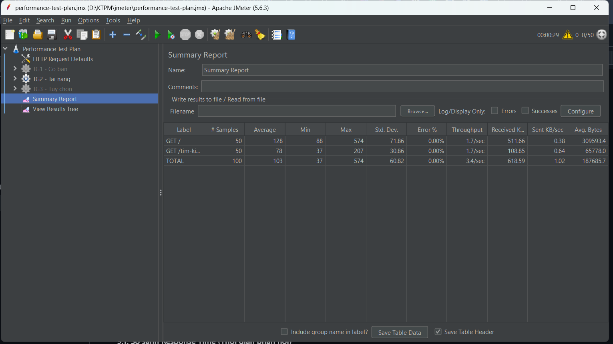
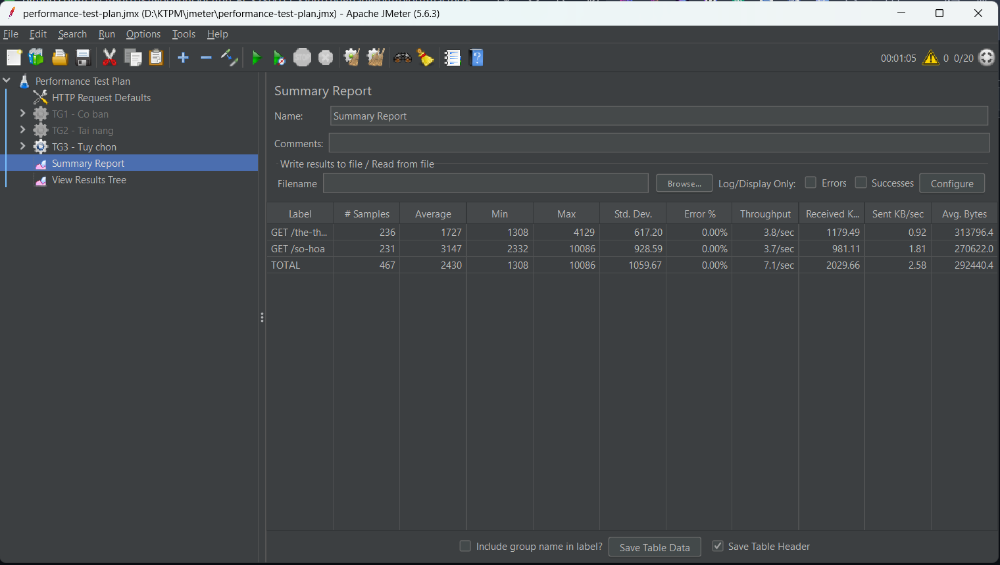
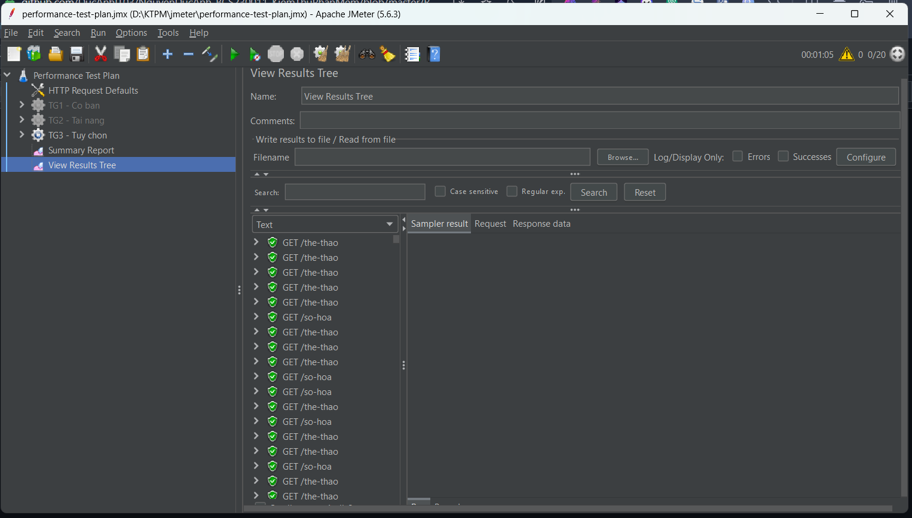
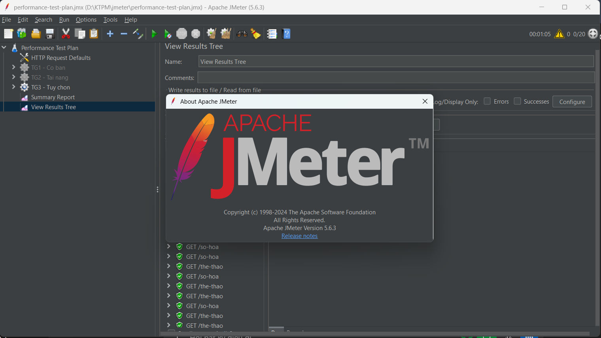
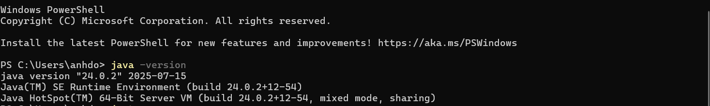
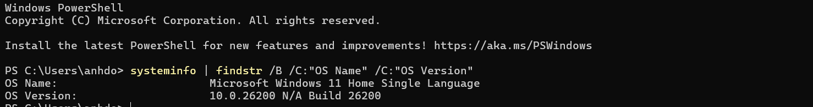

# Báo cáo môn kiểm thử phần mềm 
## Thông tin sinh viên 
- **Họ và tên** : Nguyễn Đức Anh
- **Mã sinh viên** : BIT230027
- **Lớp** : 23IT-GM
- **Môn học** : Kiểm thử phần mềm
- **Giảng viên** : Phạm Tuấn Anh

---
# Bài tập tuần 1 (05/01/2026 - 11/01/2026): Can't Unsee (trang web trò chơi luyện lỗi UI/UX)
### Mô tả Bài tập

**Can't Unsee** (trò chơi luyện nhận diện lỗi) là một trò chơi nhỏ giúp rèn luyện khả năng phát hiện các lỗi trong thiết kế **UI/UX (giao diện người dùng/trải nghiệm người dùng)**.
Bài tập yêu cầu quan sát và nhận diện các vấn đề liên quan đến:

- Căn chỉnh giao diện
- Khoảng cách giữa các thành phần
- Tính nhất quán
- Khả năng đọc và trải nghiệm người dùng

🔗 Liên kết bài tập: https://cantunsee.space (trang web của trò chơi)

### Kết quả đạt được
- Điểm số : 8130
- Xếp hạng : Bậc thầy (Hoàn hảo!)
- Thời gian hoàn thành : 00:13:58

Kết quả cho thấy khả năng quan sát và nhận diện lỗi giao diện ở mức xuất sắc so với đa số người tham gia.

### Minh chứng hoàn thành
Ảnh chụp màn hình kết quả sau khi hoàn thành bài tập:


> **Minh chứng thể hiện rõ:**
>
> - Tên bài tập : *Can't Unsee*
> - Điểm số đạt được : **8130**
> - Xếp hạng : **Bậc thầy** (Hoàn hảo!)
> - Thời gian hoàn thành bài tập : **00:13:58**

### Nhận xét và đánh giá 

Thông qua bài tập này,em:
- Nâng cao khả năng phát hiện lỗi giao diện người dùng
- Hiểu rõ hơn vai trò của UI/UX trong kiểm thử phần mềm
- Rèn luyện tư duy chi tiết và khả năng đánh giá trải nghiệm người dùng

Bài tập có tính thực tiễn cao, hỗ trợ tốt cho việc học **Kiểm thử phần mềm**. 

### Cam kết 

Em xin cam kết rằng kết quả trên là do **chính em thực hiện**, không sao chép và không sử dụng bất kỳ hình thức gian lận nào.

**Sinh viên thực hiện**

Nguyễn Đức Anh 

---
# Bài tập tuần 2 (12/01/2026 - 18/01/2026): Kiểm thử với JUnit (khung kiểm thử Java)
### 1. Giới thiệu
Bài tập thực hành phân tích dữ liệu điểm số học sinh bằng ngôn ngữ Java, áp dụng kỹ thuật kiểm thử tự động với thư viện **JUnit 5**.

Chương trình bao gồm lớp `StudentAnalyzer` với 2 chức năng chính:
1.  **`countExcellentStudents(List<Double> scores)`**: Đếm số học sinh đạt loại Giỏi (>= 8.0).
2.  **`calculateValidAverage(List<Double> scores)`**: Tính điểm trung bình của các điểm hợp lệ (0..10).

### 1.1. Yêu cầu và ràng buộc chi tiết
- **Đầu vào**: Danh sách `List<Double>` (có thể chứa `null`, giá trị âm, hoặc > 10).
- **Quy tắc hợp lệ**: Chỉ chấp nhận điểm trong đoạn `[0, 10]`. Giá trị `null` hoặc ngoài khoảng này được coi là dữ liệu sai và bị bỏ qua.
- **Giá trị trả về**:
    * `countExcellentStudents`: Trả về số lượng điểm hợp lệ >= 8.0. Nếu danh sách `null` hoặc rỗng trả về `0`.
    * `calculateValidAverage`: Trả về trung bình cộng các điểm hợp lệ. Nếu không có điểm hợp lệ nào, trả về `0.0` (để tránh lỗi chia cho 0).
- **Yêu cầu kỹ thuật**: Sử dụng 2 vòng lặp độc lập để tách biệt logic đếm và tính toán.

### 1.2. Thuật toán tóm tắt
- **Bước chung**: Kiểm tra `null`/rỗng ngay đầu hàm và trả về giá trị mặc định.
- **Đếm học sinh Giỏi**: Duyệt từng phần tử, bỏ qua `null` hoặc giá trị ngoài `[0,10]`. Tăng biến đếm nếu giá trị >= 8.0.
- **Tính trung bình hợp lệ**: Duyệt lần hai, cộng dồn các giá trị hợp lệ vào `sum` và tăng biến đếm `validCount`.
    * Nếu `validCount == 0` $\rightarrow$ trả về `0.0`.
    * Ngược lại $\rightarrow$ trả về `sum / validCount`.

### 1.3. Lý do chọn hướng xử lý này
- **Tách biệt logic**: Việc tách hai vòng lặp giúp mã nguồn rõ ràng, dễ bảo trì và mở rộng theo đúng yêu cầu bài toán.
- **An toàn**: Trả về `0` hoặc `0.0` khi dữ liệu không hợp lệ giúp tránh ngoại lệ `ArithmeticException` (lỗi chia cho 0) và phản ánh đúng ngữ nghĩa "không có kết quả".

### 2. Mục tiêu học tập
- ✅ Biết cách viết kiểm thử tự động bằng **JUnit 5**.
- ✅ Hiểu tư duy kiểm tra tính hợp lệ của dữ liệu (Validation) và xử lý các trường hợp biên (Boundary).
- ✅ Thực hành khai thác AI tạo sinh để hỗ trợ lập trình (gợi ý test case, rà soát logic).

### 3. Cấu trúc thư mục
```text
KTPM/
├── unit-test/
│   ├── src/
│   │   └── StudentAnalyzer.java      # Mã nguồn chính
│   └── test/
│       └── StudentAnalyzerTest.java  # Mã nguồn kiểm thử
└── README.md                         # Tài liệu báo cáo (File này)
```

### 4. Mô tả chức năng chi tiết
* **Điều kiện chung**: Mọi giá trị nằm ngoài đoạn `[0, 10]` hoặc là `null` đều bị bỏ qua (skip).
* **Xử lý rỗng**: Nếu danh sách đầu vào là rỗng hoặc `null`:
    * Hàm đếm trả về `0`.
    * Hàm tính trung bình trả về `0.0`.
* **Vòng lặp 1 (Hàm đếm)**: Duyệt danh sách để đếm số điểm >= 8.0 sau khi đã lọc dữ liệu rác.
* **Vòng lặp 2 (Hàm trung bình)**: Duyệt danh sách để tính tổng và đếm số lượng phần tử hợp lệ, sau đó thực hiện phép chia.

### 5. Kiểm thử đơn vị (JUnit 5 - khung kiểm thử Java)
Các nhóm tình huống đã kiểm thử trong `StudentAnalyzerTest`:

1.  **Trường hợp bình thường**: Danh sách có cả hợp lệ và không hợp lệ.
2.  **Trường hợp biên**: Danh sách trống; danh sách toàn 0; danh sách toàn 10.
3.  **Trường hợp ngoại lệ dữ liệu**: Có điểm <0, >10, hoặc null.
4.  **Độ chính xác**: Số thực so sánh với sai số `±0.01`.

### 5.1. Bảng ca kiểm thử chính

| Tên Test Case | Dữ liệu đầu vào (Input) | Kết quả kỳ vọng (Expected) | Ghi chú |
| :--- | :--- | :--- | :--- |
| **countExcellentStudents** | | | |
| Trộn điểm hợp lệ và không hợp lệ | `[9.0, 8.5, 7.0, 11.0, -1.0]` | `2` | Chỉ lấy 9.0 và 8.5 |
| Rỗng | `[]` | `0` | |
| Toàn 0 | `[0, 0, 0]` | `0` | |
| Toàn 10 | `[10, 10, 10]` | `3` | |
| Toàn dữ liệu sai | `[-5, 11, 12.5]` | `0` | |
| **calculateValidAverage** | | | |
| Trộn điểm hợp lệ và không hợp lệ | `[9.0, 8.5, 7.0, 11.0, -1.0]` | `8.17` | Sai số cho phép 0.01 |
| Rỗng | `[]` | `0.0` | |
| Toàn 0 | `[0, 0, 0]` | `0.0` | |
| Toàn 10 | `[10, 10, 10]` | `10.0` | |
| Toàn dữ liệu sai hoặc null | `[-3.0, 15.0, null]` | `0.0` | Tránh chia cho 0 |

### 6. Cách chạy kiểm thử

### 6.1. Chuẩn bị môi trường
* **Yêu cầu**: JDK 17+ (bộ phát triển Java, có sẵn `javac`, `java`).
* **Tải JUnit Platform Console Standalone** (gói chạy JUnit độc lập, ví dụ 6.0.2): [Link tải tại Maven Repository](https://repo1.maven.org/maven2/org/junit/platform/junit-platform-console-standalone/6.0.2/).
* **Đặt đường dẫn jar vào biến môi trường tạm `JUNIT_JAR`**:

Ví dụ trên Windows (PowerShell - terminal của VS Code/Windows):
```powershell
$env:JUNIT_JAR="D:\junit-platform-console-standalone-6.0.2.jar"
```

Ví dụ trên CMD (Command Prompt):
```cmd
set JUNIT_JAR=D:\junit-platform-console-standalone-6.0.2.jar
```

### 6.2. Biên dịch
Tại thư mục gốc của kho mã nguồn (chứa thư mục `unit-test/`), tạo thư mục đầu ra nếu chưa có:
```bash
mkdir unit-test/out
```

Biên dịch mã nguồn và tệp kiểm thử:

Ví dụ trên Windows (PowerShell - terminal của VS Code/Windows):
```powershell
javac -cp "$env:JUNIT_JAR" -d unit-test\out unit-test\src\StudentAnalyzer.java unit-test\test\StudentAnalyzerTest.java
```

Ví dụ trên CMD (Command Prompt):
```cmd
javac -cp "%JUNIT_JAR%" -d unit-test/out unit-test/src/StudentAnalyzer.java unit-test/test/StudentAnalyzerTest.java
```

### 6.3. Chạy kiểm thử 
Chạy bảng điều khiển JUnit để quét classpath (đường dẫn chứa class) và thực thi kiểm thử:

Ví dụ trên Windows (PowerShell - terminal của VS Code/Windows):
```powershell
java -jar "$env:JUNIT_JAR" execute --class-path unit-test\out --scan-class-path
```

Ví dụ trên CMD (Command Prompt):
```cmd
java -jar "%JUNIT_JAR%" execute --class-path unit-test\out --scan-class-path
```

### 6.4. Tuỳ chọn: chạy khi đang ở thư mục unit-test
Nếu bạn `cd unit-test` trước, có thể dùng lệnh ngắn gọn:

Ví dụ trên Windows (PowerShell - terminal của VS Code/Windows):
```powershell
javac -cp "$env:JUNIT_JAR" -d out src\StudentAnalyzer.java test\StudentAnalyzerTest.java
java -jar "$env:JUNIT_JAR" execute --class-path out --scan-class-path
```

Ví dụ trên CMD (Command Prompt):
```cmd
javac -cp "%JUNIT_JAR%" -d out src/StudentAnalyzer.java test/StudentAnalyzerTest.java
java -jar "%JUNIT_JAR%" execute --class-path out --scan-class-path
```

### 6.5. Kỳ vọng khi chạy
- Toàn bộ kiểm thử trong StudentAnalyzerTest hiển thị trạng thái PASSED (thành công theo thông báo của JUnit).
- Không có lỗi ClassNotFound (không tìm thấy lớp); nếu có, kiểm tra biến JUNIT_JAR và đường dẫn out.

### 6.6. Kết quả 
```arduino
Thanks for using JUnit! Support its development at https://junit.org/sponsoring

.
+-- JUnit Platform Suite [OK]
+-- JUnit Jupiter [OK]
| '-- StudentAnalyzerTest [OK]
|   +-- testCalculateValidAverage_withMixedValidAndInvalid() [OK]
|   +-- testCalculateValidAverage_emptyList() [OK]
|   +-- testCountExcellentStudents_allInvalid() [OK]
|   +-- testCountExcellentStudents_boundaryValues() [OK]
|   +-- testCountExcellentStudents_withMixedValidAndInvalid() [OK]
|   +-- testCountExcellentStudents_emptyList() [OK]
|   +-- testCalculateValidAverage_allInvalid() [OK]
|   '-- testCalculateValidAverage_boundaryValues() [OK]
'-- JUnit Vintage [OK]

Test run finished after 214 ms
[         4 containers found      ]
[         0 containers skipped    ]
[         4 containers started    ]
[         0 containers aborted    ]
[         4 containers successful ]
[         0 containers failed     ]
[         8 tests found           ]
[         0 tests skipped         ]
[         8 tests started         ]
[         0 tests aborted         ]
[         8 tests successful      ]
[         0 tests failed          ]
```
---
# Bài tập tuần 3 (19/01/2026 - 25/01/2026): Kiểm thử tự động End-to-End với Cypress
### Minh chứng hoàn thành


---
# Bài tập tuần 4 (26/01/2026 - 01/02/2026): Kiểm thử hiệu năng với JMeter
### 1. Giới thiệu
Bài tập: Sử dụng **Apache JMeter** (công cụ kiểm thử hiệu năng mã nguồn mở - open source performance testing tool) để thực hiện kiểm thử hiệu năng trên một trang web.  
Mục tiêu của bài tập:
- Hiểu cách sử dụng JMeter để thực hiện kiểm thử hiệu năng
- Thiết kế kịch bản kiểm thử với các tham số khác nhau (có tính cá nhân hoá)
- Phân tích kết quả kiểm thử và viết báo cáo

### 1.1. Website được kiểm thử
- **URL**: https://vnexpress.net
- **Mô tả**: Trang tin tức điện tử hàng đầu Việt Nam
- **Lý do chọn**: Website có lượng truy cập lớn, phù hợp để kiểm thử hiệu năng và đánh giá khả năng xử lý tải của hệ thống

### 2. Mục tiêu học tập
- Biết cách cài đặt và sử dụng JMeter để kiểm thử hiệu năng
- Hiểu các khái niệm về Thread Group (nhóm luồng - group of threads/users), HTTP Request (yêu cầu HTTP - HTTP request), Listeners (bộ lắng nghe - components that collect and display test results)
- Biết cách thiết kế kịch bản kiểm thử với các tham số khác nhau (số lượng người dùng, thời gian chạy, hành vi người dùng)
- Hiểu cách phân tích các chỉ số quan trọng: Response Time (thời gian phản hồi - response time), Throughput (thông lượng - throughput: requests per second), Error Rate (tỷ lệ lỗi - error rate: percentage of failed requests)
- Thực hành viết báo cáo kiểm thử hiệu năng

### 3. Cấu trúc thư mục
```
jmeter/
├── performance-test-plan.jmx    # File test plan JMeter (kế hoạch kiểm thử - test plan file)
├── README.md                    # Hướng dẫn chi tiết sử dụng JMeter
├── REPORT.md                    # Template báo cáo kết quả kiểm thử (mẫu báo cáo - report template)
├── QUICK_START.md              # Hướng dẫn nhanh (hướng dẫn nhanh - quick start guide)
├── .gitignore                   # Git ignore file (file bỏ qua của Git - Git ignore configuration)
└── results/                     # Thư mục lưu kết quả test (kết quả - results directory)
    ├── results.jtl              # File kết quả JMeter (file kết quả - JMeter results file)
    └── report/                  # HTML report (báo cáo HTML - HTML report directory)
```

### 4. Cấu hình Test Plan

File `performance-test-plan.jmx` chứa **3 kịch bản kiểm thử** (Thread Groups - nhóm luồng: group of threads/users) với các tham số khác nhau:

#### 4.1. Thread Group 1: Kịch bản cơ bản
- **Số lượng người dùng (Threads - luồng)**: ~10
- **Số lần lặp (Loop Count - số vòng lặp)**: 5
- **Ramp-up Period (thời gian tăng dần)**: 1 giây
- **Tổng số request (yêu cầu)**: 10 × 5 = 50 requests
- **Endpoint được test (điểm cuối được kiểm thử)**: 
  - GET `/` (Trang chủ)
- **Mục đích**: Kiểm tra hiệu năng cơ bản của website với lượng truy cập nhỏ

#### 4.2. Thread Group 2: Kịch bản tải nặng
- **Số lượng người dùng (Threads - luồng)**: ~50
- **Ramp-up Period (thời gian tăng dần)**: 30 giây (tăng dần từ 0 đến 50 users trong 30 giây)
- **Tổng số request (yêu cầu)**: ~100 requests (50 users × 2 endpoints)
- **Endpoints được test (điểm cuối được kiểm thử)**: 
  - GET `/` (Trang chủ)
  - GET `/tim-kiem?q=tin tức` (Trang tìm kiếm)
- **Mục đích**: Kiểm tra khả năng xử lý tải cao của hệ thống khi có nhiều người dùng đồng thời

#### 4.3. Thread Group 3: Kịch bản tùy chỉnh
- **Số lượng người dùng (Threads - luồng)**: ~20
- **Thời gian chạy (Duration - thời lượng)**: 60 giây
- **Ramp-up Period (thời gian tăng dần)**: 10 giây
- **Endpoints được test (điểm cuối được kiểm thử)**: 
  - GET `/the-thao` (Trang thể thao)
  - GET `/so-hoa` (Trang công nghệ)
- **Mục đích**: Mô phỏng người dùng duyệt nhiều trang khác nhau trong một phiên làm việc

### 5. Các thành phần trong Test Plan

#### 5.1. HTTP Request Defaults (Mặc định yêu cầu HTTP)
- Cấu hình URL cơ sở: `${BASE_URL}` (mặc định: `https://vnexpress.net`)
- Cho phép dễ dàng thay đổi website cần test bằng cách sửa biến `BASE_URL`

#### 5.2. Listeners (Bộ lắng nghe)
- **Summary Report (Báo cáo tóm tắt)**: Hiển thị tổng quan về kết quả test (Response Time - thời gian phản hồi, Throughput - thông lượng, Error Rate - tỷ lệ lỗi)
- **View Results Tree (Xem cây kết quả)**: Hiển thị chi tiết từng request (Request/Response headers - tiêu đề yêu cầu/phản hồi, body - nội dung, status code - mã trạng thái)

### 6. Cách chạy kiểm thử

#### 6.1. Yêu cầu hệ thống
- **Java**: JDK 8+ (Java Development Kit - bộ phát triển Java) hoặc JRE 8+ (Java Runtime Environment - môi trường chạy Java) (JMeter yêu cầu Java để chạy)
- **JMeter**: Tải từ https://jmeter.apache.org/download_jmeter.cgi
- Kiểm tra Java đã cài đặt:
  ```bash
  java -version
  ```

#### 6.2. Chạy Test Plan (GUI Mode - Chế độ giao diện đồ họa)
1. Mở JMeter: Chạy file `bin/jmeter.bat` (Windows) hoặc `bin/jmeter.sh` (Linux/Mac)
2. Mở Test Plan (Kế hoạch kiểm thử): **File** → **Open** → Chọn `jmeter/performance-test-plan.jmx`
3. Tùy chỉnh URL (nếu cần): Mở **User Defined Variables (Biến do người dùng định nghĩa)** → Sửa `BASE_URL`
4. Chạy từng Thread Group:
   - **Vô hiệu hóa** các Thread Group không cần: Click phải → **Disable (Tắt)**
   - **Kích hoạt** Thread Group cần chạy: Click phải → **Enable (Bật)**
   - Click nút **Start (Bắt đầu)** (▶)
5. Xem kết quả trong **Summary Report (Báo cáo tóm tắt)** và **View Results Tree (Xem cây kết quả)**
6. Lưu kết quả:
   - Summary Report: Click phải → **Save Table Data (Lưu dữ liệu bảng)** → Lưu CSV (Comma Separated Values - giá trị phân tách bằng dấu phẩy)
   - View Results Tree: Chụp màn hình hoặc Save Table Data

#### 6.3. Chạy Test Plan (Command Line - Dòng lệnh - Khuyến nghị cho test lớn)
Chạy ở chế độ non-GUI (không giao diện đồ họa - non-GUI mode: faster and uses less resources than GUI mode):

```bash
# Di chuyển đến thư mục jmeter
cd jmeter

# Chạy test và tạo HTML report
jmeter -n -t performance-test-plan.jmx -l results/results.jtl -e -o results/report/

# Xem HTML report
# Mở file: results/report/index.html trong trình duyệt
```

Giải thích các tham số:
- `-n`: Chạy ở chế độ non-GUI (không giao diện đồ họa - non-GUI mode)
- `-t`: Đường dẫn đến file test plan (kế hoạch kiểm thử - test plan file) (.jmx)
- `-l`: Đường dẫn file kết quả (results file) (.jtl - JMeter Test Log)
- `-e`: Tạo HTML report (báo cáo HTML - HTML report) sau khi test xong
- `-o`: Thư mục chứa HTML report (báo cáo HTML - HTML report directory)

### 7. Các chỉ số quan trọng cần phân tích

#### 7.1. Response Time (Thời gian phản hồi)
- **Average (Trung bình)**: Thời gian phản hồi trung bình (ms - milliseconds: mili giây)
- **Median (Trung vị)**: Thời gian phản hồi ở giữa (50th percentile - phân vị thứ 50)
- **Min/Max (Tối thiểu/Tối đa)**: Thời gian phản hồi nhỏ nhất/lớn nhất (ms)
- **90th/95th/99th Percentile (Phân vị 90/95/99)**: Thời gian phản hồi của 90%/95%/99% request (yêu cầu)
- **Đánh giá**: Response time càng thấp càng tốt, thường < 2000ms được coi là tốt

#### 7.2. Throughput (Thông lượng)
- Số lượng request (yêu cầu) được xử lý mỗi giây (requests/second - yêu cầu/giây)
- **Đánh giá**: Throughput càng cao càng tốt, thể hiện khả năng xử lý của server (máy chủ)

#### 7.3. Error Rate (Tỷ lệ lỗi)
- Tỷ lệ request (yêu cầu) bị lỗi (%)
- **Đánh giá**: Nên < 1% trong điều kiện bình thường, = 0% là lý tưởng

#### 7.4. Concurrent Users (Người dùng đồng thời)
- Số lượng người dùng cùng lúc
- **Ảnh hưởng**: Ảnh hưởng trực tiếp đến Response Time (thời gian phản hồi) và Throughput (thông lượng)

### 8. Kết quả kiểm thử


#### 8.1. Thread Group 1: Kịch bản cơ bản
- **Samples (Mẫu)**: 50
- **Average Response Time (Thời gian phản hồi trung bình)**: 299 ms
- **Min/Max Response Time (Thời gian phản hồi tối thiểu/tối đa)**: 67 / 1700 ms
- **Error Rate (Tỷ lệ lỗi)**: 0%
- **Throughput (Thông lượng)**: 22.9 requests/giây

#### 8.2. Thread Group 2: Kịch bản tải nặng
- **Samples (Mẫu)**: 100
- **Average Response Time (Thời gian phản hồi trung bình)**: 103 ms
- **Min/Max Response Time (Thời gian phản hồi tối thiểu/tối đa)**: 37 / 574 ms
- **Error Rate (Tỷ lệ lỗi)**: 0%
- **Throughput (Thông lượng)**: 3.4 requests/giây

#### 8.3. Thread Group 3: Kịch bản tùy chỉnh
- **Samples (Mẫu)**: 467
- **Average Response Time (Thời gian phản hồi trung bình)**: 2430 ms
- **Min/Max Response Time (Thời gian phản hồi tối thiểu/tối đa)**: 1308 / 10086 ms
- **Error Rate (Tỷ lệ lỗi)**: 0%
- **Throughput (Thông lượng)**: 7.1 requests/giây

### 9. Phân tích và So sánh

#### 9.1. So sánh Response Time (Thời gian phản hồi)
- Thời gian phản hồi có sự chênh lệch lớn: TG2 (Tải nặng) lại có tốc độ nhanh nhất (103 ms), nhanh hơn cả TG1 (299 ms). Tuy nhiên, TG3 tăng vọt lên 2430 ms (trung bình) và đạt đỉnh hơn 10s khi truy cập vào các trang chuyên mục.

#### 9.2. So sánh Throughput (Thông lượng)
- Throughput cao nhất ở TG1 (22.9 req/s). TG2 có throughput thấp (3.4 req/s) do thời gian Ramp-up kéo dài. TG3 đạt 7.1 req/s.

#### 9.3. Tỷ lệ Lỗi (Error Rate)
- Cả 3 kịch bản đều đạt độ ổn định tuyệt đối với 0% lỗi, cho thấy server chịu tải tốt và không bị quá tải dẫn đến ngắt kết nối.

### 10. Kết luận

#### 10.1. Đánh giá Tổng quan
- Website hoạt động rất ổn định (không có lỗi). Tuy nhiên hiệu năng không đồng đều: Trang chủ và Tìm kiếm được tối ưu/cache rất tốt (phản hồi siêu nhanh), trong khi các trang Chuyên mục (/so-hoa, /the-thao) phản hồi chậm.

#### 10.2. Điểm Mạnh
- Tỷ lệ lỗi tuyệt đối 0%.
- Tốc độ xử lý ở kịch bản tải nặng (TG2) rất ấn tượng (103 ms), cho thấy khả năng caching tốt.

#### 10.3. Điểm Cần Cải thiện
- Cần tối ưu hóa các trang chuyên mục (TG3) vì độ trễ trung bình > 2s và max > 10s là trải nghiệm chưa tốt.

#### 10.4. Khuyến nghị
- Kiểm tra tài nguyên (ảnh/video) và truy vấn database tại các trang /the-thao và /so-hoa.
- Duy trì cấu hình Cache hiện tại cho trang chủ.

### 11. Minh chứng hoàn thành

- Summary Report TG1: 
- Summary Report TG2: 
- Summary Report TG3: 
- View Results Tree (mẫu request): 
- Runner tổng quan/phiên bản: 





### 12. Nhận xét và đánh giá

Thông qua bài tập này, em:
- Hiểu được cách sử dụng JMeter để kiểm thử hiệu năng website
- Biết cách thiết kế kịch bản kiểm thử với các tham số khác nhau (số lượng người dùng, thời gian chạy, hành vi người dùng)
- Hiểu được các chỉ số quan trọng trong kiểm thử hiệu năng: Response Time (thời gian phản hồi), Throughput (thông lượng), Error Rate (tỷ lệ lỗi)
- Biết cách phân tích và so sánh kết quả kiểm thử
- Rèn luyện kỹ năng viết báo cáo kiểm thử hiệu năng

Bài tập có tính thực tiễn cao, giúp em hiểu rõ hơn về tầm quan trọng của kiểm thử hiệu năng trong quá trình phát triển phần mềm.

### 13. Tài liệu tham khảo

- JMeter Official Documentation: https://jmeter.apache.org/usermanual/
- JMeter Best Practices: https://jmeter.apache.org/usermanual/best-practices.html
- Performance Testing Guide: https://jmeter.apache.org/usermanual/test_plan.html

### 14. Lưu ý quan trọng

1. **Không chạy test trên production (môi trường sản xuất)** nếu không được phép từ chủ sở hữu website
2. **Giới hạn số lượng request (yêu cầu)** để tránh làm quá tải server (máy chủ) và ảnh hưởng đến người dùng thật
3. **Chạy test vào giờ thấp điểm** để giảm ảnh hưởng đến người dùng thật
4. **Sử dụng non-GUI mode (chế độ không giao diện đồ họa)** cho test lớn (tiết kiệm tài nguyên và nhanh hơn)
5. **Lưu kết quả** để phân tích sau (file CSV - Comma Separated Values, HTML report - báo cáo HTML, screenshot - ảnh chụp màn hình)

### 15. Cam kết

Em xin cam kết kết quả trên là **do chính em thực hiện**, không sao chép và không sử dụng bất kỳ hình thức gian lận nào.

**Sinh viên thực hiện**  
Nguyễn Đức Anh

---


